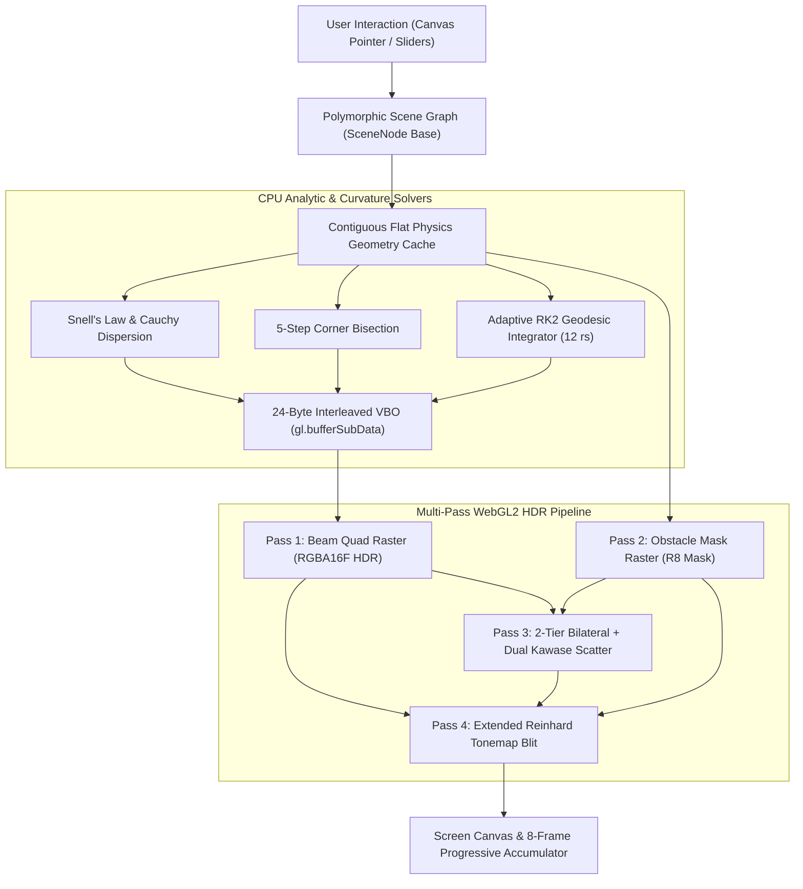

# 2D Realistic Volumetric Optics & Spacetime Curvature Engine

[](./LICENSE)
[](https://www.typescriptlang.org/)
[-ff3e00?logo=svelte)](https://svelte.dev/)
[](https://developer.mozilla.org/en-US/docs/Web/API/WebGL2RenderingContext)
[](https://vitest.dev/)
[](https://vercel.com)

A high-fidelity real-time 2D physical optics and curved spacetime simulation platform designed to deliver smooth 60 FPS performance on budget integrated GPUs. 

Unlike conventional 2D raytracers that depict light as discrete 1D laser needles or 3-channel RGB lines, this engine treats light as a **continuous 2D radiant energy field**. Wavefronts expand into continuous polygonal frustums and ribbon strips, refract continuously across the entire visible spectrum ($\lambda \in [380, 780]\text{ nm}$) via analytic CIE 1931 color-matching equations, and curve organically around Schwarzschild black holes.

---

## 🌌 Core Physical Capabilities

### 1. Continuous Wavefront Transport & Spectral Dispersion
- **Polygonal Beam Frustums:** Light is simulated as continuous 2D quads and triangle fans bounded by paired outer wavefront trajectories.
- **Analytic CIE 1931 Spectrum:** Fragment shaders compute continuous wavelength-to-sRGB integrals, eliminating discrete wavelength banding.
- **Snell's Law & Cauchy Dispersion:** Refraction follows $n(\lambda) = A + \frac{B}{\lambda^2}$, splitting white light into continuous rainbow spectra.
- **Fresnel Energy Conservation:** Energy partitions into transmitted and reflected components ($R + T = 1$), naturally attenuating secondary bounces.

### 2. High-Performance 2D Geometry Engine
- **Zero-Allocation CPU Triangulation:** Fast analytic solvers for line segments and circular/parabolic arcs write directly to typed arrays.
- **5-Step Adaptive Bisection:** Corner snapping ($\epsilon < 0.5\text{ px}$) prevents light leakage at obstacle vertices.
- **Branch Pruning & Depth Capping:** Low-energy reflections ($I < 0.005$) and deep TIR loops ($\text{depth} \le 8$) are culled.
- **24-Byte Interleaved VBO Layout:**
  `[Float32x2: a_Position (x,y), Float32: a_Intensity, Float32: a_DispersionU, Float32: a_EdgeV, Uint8x4: a_ParentColorRGB]`

### 3. Non-Euclidean General Relativity & Curved Spacetime
- **Distance-Mapped Adaptive RK2 Geodesic Integrator:** Field marching within $R_{\text{influence}} = 12 r_s$ with adaptive time stepping $\Delta t(r)$ and step budget $N_{\text{max}} = 64$.
- **Smooth Boundary Transition:** $C^1$-continuous smoothstep gravity acceleration fade over $[10 r_s, 12 r_s]$.
- **Contiguous Caustic Ribbons:** Double-sided additive quad strips with $\epsilon_{\text{pinch}} = 0.5\text{ px}$ focusing caustic energy spikes.
- **Gravitational Redshift & Dilation:** Vertex-stage Schwarzschild wavelength scaling $(1+z) = (1 - r_s/r)^{-1/2}$ and photopic extinction damping $>780\text{ nm}$.
- **4-Condition Loop Termination:** Immediate capture at $r \le r_s$, boundary exit handoff at $r \ge 12 r_s$, $2\pi$ angular winding cap, and 64-step failsafe.

### 4. Atmospheric Post-Processing & Multi-Pass HDR Pipeline
- **Pass 1:** Forward Beam Quad Rasterization (`RGBA16F` HDR buffer, additive blending).
- **Pass 2:** Dedicated 1-byte `R8` Obstacle Geometry Mask rasterization preventing light bleeding into solid glass/prisms.
- **Pass 3:** Two-Tier Hybrid Volumetric Scatter (1/2-res 5-tap cross-bilateral blur + 2-stage Dual Kawase bloom for Rayleigh/Mie dust haze).
- **Pass 4:** Composite & Extended Reinhard Tonemap blit ($L_{\text{white}} = 4.0$, $\gamma = 2.2$).
- **Temporal Management:** 60 FPS single-pass during dragging, 8-frame progressive EMA accumulation when static, and idle sleep.

---

## 🎛️ Interactive Runtime & Controls

- **Direct 2D Canvas Manipulation:** Sub-pixel pointer hit-testing and dragging directly on the WebGL canvas without DOM reflow jitter.
- **Contextual On-Canvas Gizmos:** Subtle transform rings, angle rotation arms, and focal aperture resize handles.
- **32-Slot Snapshot Undo/Redo:** Deterministic circular history buffer committed on pointer release (`Ctrl+Z` / `Ctrl+Y`).
- **URL Preset Compression:** Encodes entire scene graph states into compact Base64 `lz-string` URL hash fragments for instant sharing.
- **Svelte 5 Flat Matte Dark UI:** Solid slate/zinc panels, 1px `#27272a` borders, tabular monospace readouts, and strictly zero `backdrop-filter: blur()`.

---

## 🧪 5 Bundled Optical Presets

1. **Newton's Prism Dispersion:** White continuous light beam split into a continuous rainbow spectrum via Crown Glass N-BK7.
2. **Convex/Concave Lens Focus:** Laser wavefront focused to a caustic focal point through an analytic biconvex spherical lens.
3. **Schwarzschild Relativistic Deflection:** Grazing beam gravitational deflection, photon sphere capture, and gravitational redshift around a black hole.
4. **TIR Porro Prism Retroreflector:** Total internal reflection inside a 45-45-90 right angle prism returning light 180°.
5. **Achromatic Doublet:** Chromatic aberration correction pairing a Crown glass convex lens with a Flint glass concave lens.

---

## 🏗️ Master Engine Architecture



---

## 🚀 Quick Start & Local Development

### Prerequisites
- Node.js 18+ or 20+
- npm, pnpm, or yarn

### Installation & Setup

```bash
# Clone the repository
git clone https://github.com/Sayanthegamer/light-sim.git
cd light-sim

# Install dependencies
npm install

# Start local Vite development server
npm run dev
```

### Automated Testing & Diagnostics

```bash
# Run Vitest test suite (135 tests)
npm test

# Run tests with code coverage report
npx vitest run --coverage

# Run Svelte and TypeScript strict diagnostic check
npm run check

# Build production bundle
npm run build
```

---

## ☁️ Deployment on Vercel

This repository is pre-configured with `vercel.json` for zero-configuration deployment on [Vercel](https://vercel.com):

1. Import repository `https://github.com/Sayanthegamer/light-sim` on Vercel.
2. Select **Vite** framework preset (detected automatically).
3. Deploy!

Or deploy via the Vercel CLI:
```bash
npx vercel --prod
```

---

## 📜 License & Legal

This project is licensed under the **MIT License** — see the [LICENSE](./LICENSE) file for details.

Developed with ❤️ by **[Sayan (sayanthegamer)](https://github.com/Sayanthegamer)** (`sayanbnk2008@gmail.com`).
